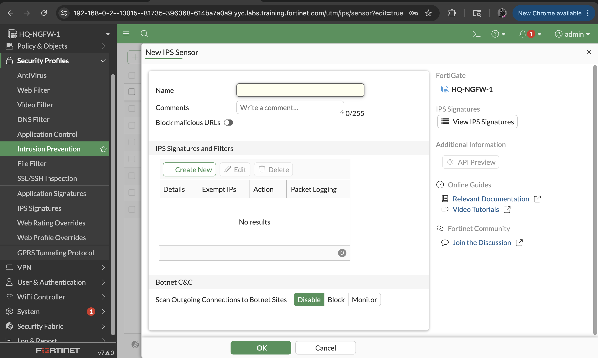
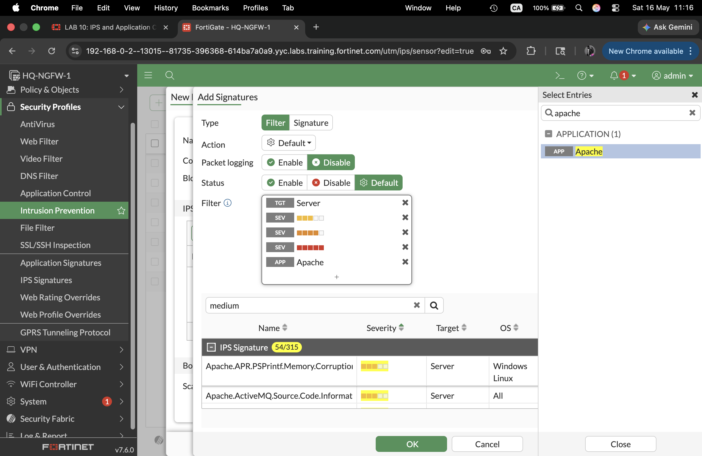
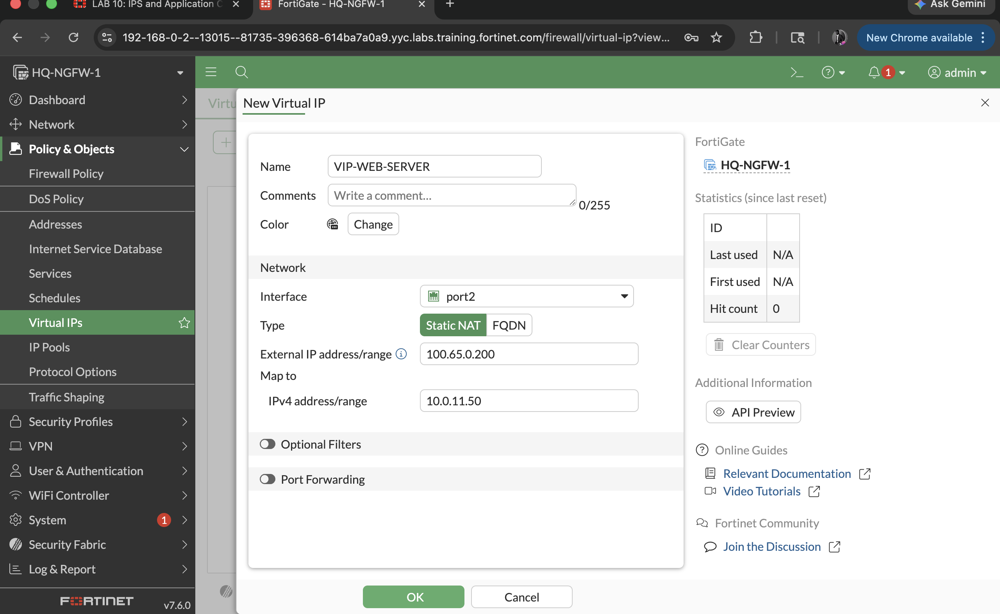
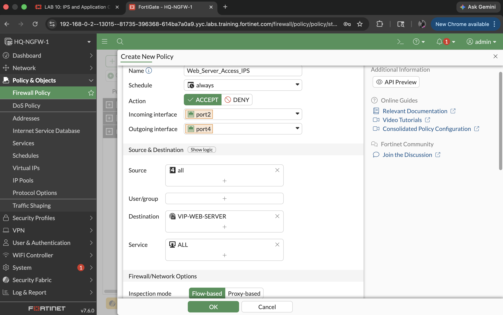
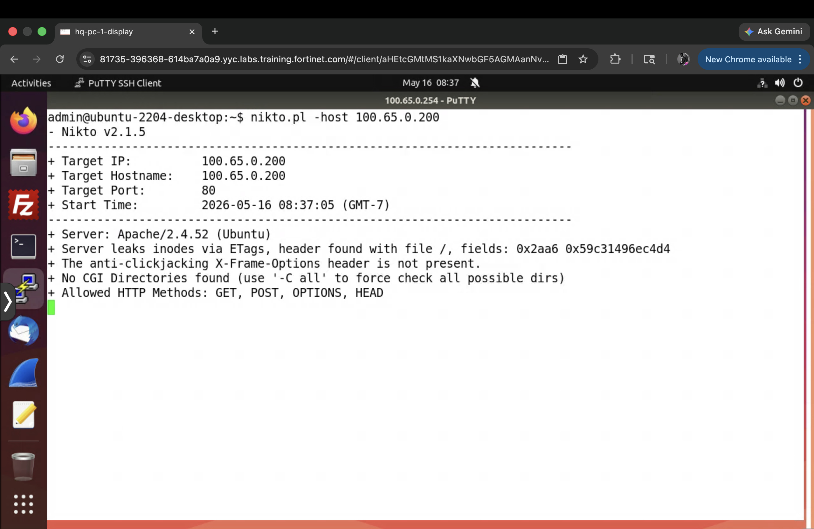
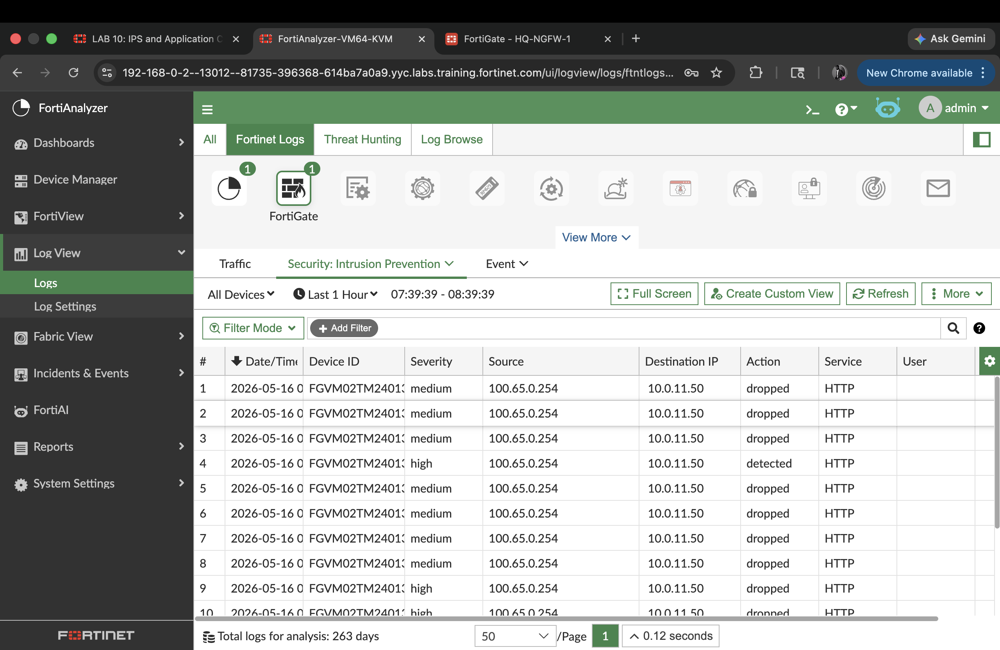
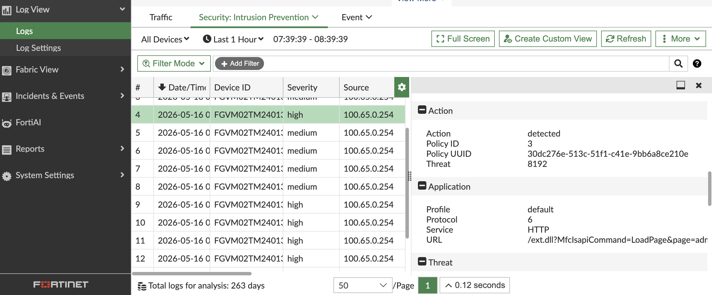
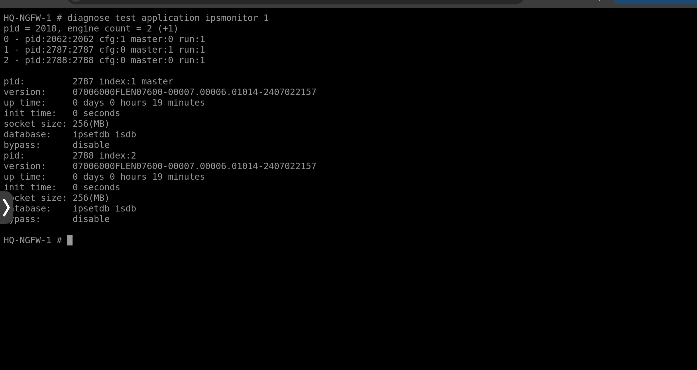
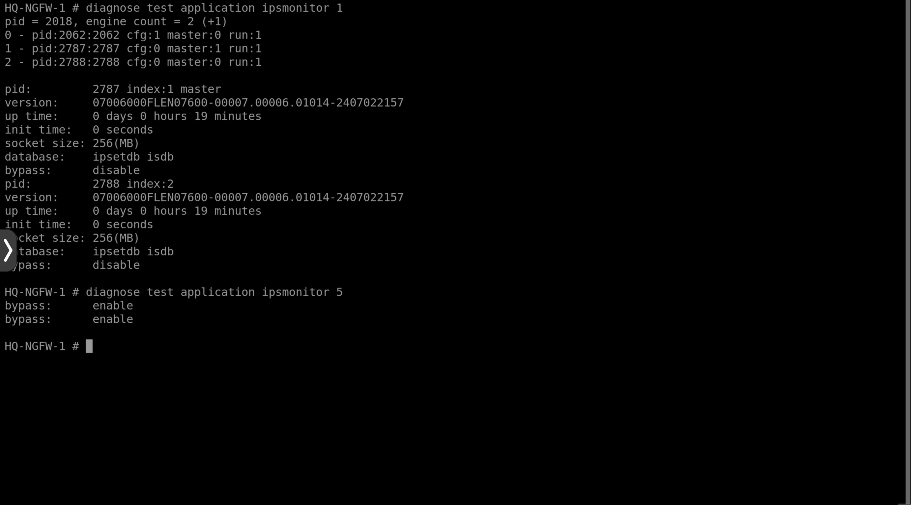
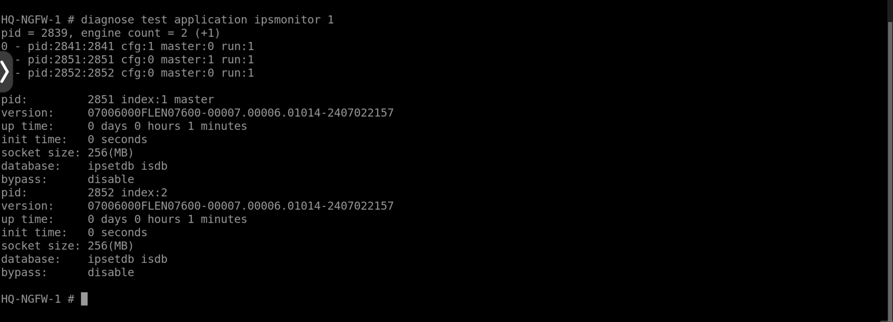

# FortiGate IPS – Blocking Known Exploits on a Web Server

> **Platform:** FortiGate Next-Generation Firewall (FortiOS)  
> **Tools Used:** FortiGate, FortiAnalyzer, Nikto Web Scanner, PuTTY  
> **Skills Demonstrated:** IPS Configuration, Virtual IPs, Firewall Policy, Log Analysis, CLI Diagnostics

---

## Project Summary

In this project, I configured and validated **Intrusion Prevention System (IPS)** inspection on a FortiGate NGFW to protect an internal Apache web server from known exploits. I built a custom IPS sensor, exposed the server through a Virtual IP, simulated real attacks using the Nikto scanner, and analysed the results through FortiAnalyzer. I also used FortiGate CLI tools to monitor and control IPS engine behaviour.

---

## Environment

```
[LINUX Attack Server]
        |
   (port2 - WAN) ← External IP: 100.65.0.200
        |
  [HQ-NGFW-1] — FortiGate NGFW
        |
   (port4 - LAN)
        |
  [HQ-PC-1] — Apache Web Server (10.0.11.50)

[FortiAnalyzer] — Centralised log management
```

| Device        | Role                          | Address / Interface       |
|---------------|-------------------------------|---------------------------|
| HQ-NGFW-1     | FortiGate Next-Gen Firewall   | Management GUI            |
| HQ-PC-1       | Internal Apache Web Server    | 10.0.11.50                |
| LINUX Server  | Simulated external attacker   | External (WAN-side)       |
| FortiAnalyzer | Log collection and analysis   | Management GUI            |
| VIP           | External-to-internal NAT      | 100.65.0.200 → 10.0.11.50 |

---

## What I Did

### 1. Built a Custom IPS Sensor

I created a custom IPS sensor called **WEBSERVER** under Security Profiles → Intrusion Prevention. Rather than using a generic sensor, I scoped it specifically to the environment by combining severity, target, and application filters — ensuring FortiGate only loads signatures relevant to an Apache server.

| Filter Type | Value    |
|-------------|----------|
| Severity    | Medium   |
| Severity    | High     |
| Severity    | Critical |
| Target      | Server   |
| Application | Apache   |



Once all filters were added, the completed WEBSERVER sensor looked like this:



---

### 2. Configured a Virtual IP (VIP)

To allow external traffic to reach the internal web server, I configured a Virtual IP that maps the public-facing address to the private server IP. This is the standard FortiGate mechanism for exposing internal services without putting them directly on the internet.

| Field                | Value          |
|----------------------|----------------|
| Name                 | VIP-WEB-SERVER |
| External Interface   | port2          |
| External IP          | 100.65.0.200   |
| Internal (Mapped) IP | 10.0.11.50     |



---

### 3. Created a Firewall Policy with IPS Enforcement

I created an inbound firewall policy that applies the WEBSERVER IPS sensor to all traffic destined for the web server. Flow-based inspection was selected to keep performance overhead low while still providing full IPS coverage.

| Field              | Value                  |
|--------------------|------------------------|
| Policy Name        | Web_Server_Access_IPS  |
| Incoming Interface | port2 (WAN)            |
| Outgoing Interface | port4 (LAN)            |
| Source             | all                    |
| Destination        | VIP-WEB-SERVER         |
| Service            | ALL                    |
| Action             | ACCEPT                 |
| Inspection Mode    | Flow-based             |
| NAT                | Disabled               |
| IPS Sensor         | WEBSERVER              |
| SSL Inspection     | Certificate Inspection |



---

### 4. Simulated a Web Attack Using Nikto

From the external Linux server, I ran the Nikto web vulnerability scanner against the public IP to simulate a real-world attack. Nikto fired a series of known HTTP exploits and vulnerability probes at the server while FortiGate inspected the traffic in real time.

```bash
nikto.pl -host 100.65.0.200
```



---

### 5. Analysed IPS Logs in FortiAnalyzer

After the attack simulation, I reviewed the IPS logs in FortiAnalyzer under Log View → Security → Intrusion Prevention. FortiGate had detected and dropped multiple packets matching known Apache vulnerability signatures.



I cross-referenced each log entry against the FortiGuard Labs Threat Encyclopedia, which provided CVE references, affected software versions, severity ratings, and recommended remediation steps. This also revealed that some triggered signatures targeted software not present on the server — in a production environment those would be removed from the sensor to reduce noise and improve throughput.



---

### 6. Diagnosed and Controlled the IPS Engine via CLI

I used FortiGate CLI diagnostic commands to inspect and control the IPS engine directly.

**Checking the current IPS engine status:**
```bash
diagnose test application ipsmonitor 1
```
This returns the engine health, process ID, and current bypass mode status.



**Enabling bypass mode to temporarily disable IPS inspection:**
```bash
diagnose test application ipsmonitor 5
```
While bypass is active, traffic passes through without IPS inspection and no log entries are generated. This is a break-glass option for troubleshooting but should never be left on in production.



**Restarting the IPS engine:**
```bash
diagnose test application ipsmonitor 99
```
This restarts all IPS-related processes. After restart, the process ID changes and bypass mode automatically resets to disabled — a built-in safety mechanism to prevent accidental exposure.



---

## Results

- Successfully blocked multiple known Apache exploits matching medium, high, and critical severity signatures
- FortiAnalyzer logs confirmed real-time detection and dropping of attack traffic
- Identified over-broad signatures not applicable to the deployed application — flagged for sensor tuning
- Confirmed IPS engine bypass and restart behaviour using CLI diagnostics

---

## Key Learnings

- Scoping IPS sensors by severity, target, and application is critical for both accuracy and performance — a broad sensor wastes resources on irrelevant signatures
- Virtual IPs are the standard FortiGate mechanism for exposing internal services to external networks with NAT
- Flow-based inspection suits high-throughput scenarios; proxy-based offers deeper inspection at a performance cost
- Bypass mode is a useful break-glass option but should never be left enabled in production
- Reviewing triggered signatures against your actual software stack is an essential part of IPS tuning — not all detections are actionable

---

*Part of my Fortinet security portfolio — https://github.com/iVanny11-tech/fortinet-security-labs/edit/My-fortinet-lab/README_1.md*
